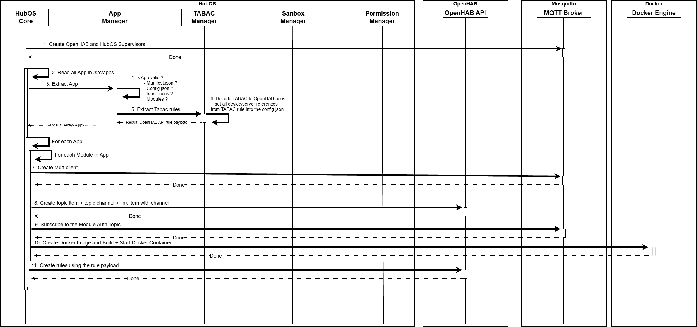
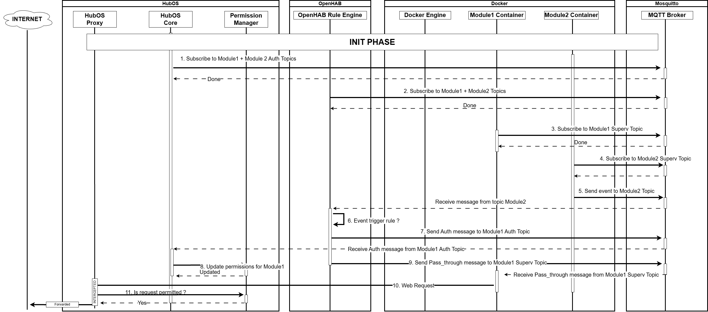

# HubOS 2.0 - Devs Documentation

<!--## Description-->

This README is intended to provide developers with a clear and structured understanding of how the application is designed, built, and operated.

It explains the overall architecture of an application, and its modules, and the logic of TABAC rules, with a particular focus on how those rules are implemented and enforced within the system.

The document serves as a practical guide for:
- Understanding the purpose and scope of the application
- Identifying and navigating the different modules and services
- Learning how TABAC rules are modeled, validated, and applied
- Setting up a development environment and extending the application safely
- Maintaining consistency with regulatory constraints and business logic

Rather than acting as a full technical specification, this documentation aims to bridge the gap between business requirements and technical implementation, allowing any developer joining the project to quickly understand:
- How to create an application,
- How to create TABAC rules, and
- how those rules interact with the codebase.

By following this documentation, developers should be able to create new application or new features, adjust regulatory logic, or refactor existing components while preserving compliance, security, and architectural coherence.

>[!NOTE]
> For a beter and deeper understanding of this project and how it operates, it is strongly recommended to read the associated [master’s thesis](www.example.com) that led to the creation of this system. 
 
## Table of Content
TO DO
## Core Concepts

Within the HubOS environment, three core concepts must be clearly defined and understood:

### 1. HubOS System
The HubOS system is responsible for the overall platform logic. It handles:

- Application validation and lifecycle management

- Creation and orchestration of Docker containers

- Interaction with OpenHAB for the creation and management of rules, items, channels, and related automation components

The HubOS system acts as the central authority that enforces consistency, security, and regulatory constraints across all applications.

### 2. Applications

Applications are developed and shared by users. Their purpose is to extend the functionality of the OpenHAB environment.

Examples include:

- A facial recognition application using cameras connected to OpenHAB

- A local-first voice assistant application

- Security, monitoring, or automation services

Each application follows a specific directory structure, which is described in the [next section](#composition-of-an-application), and operates under the constraints defined by HubOS and the applicable rules.

### 3. Modules

Modules are the primary building blocks of applications. They consist of source code bundled with a Dockerfile and are executed within isolated Docker containers.

Each module is designed to perform a well-defined task.
The role, lifecycle, and interaction model of modules are described in more detail in a dedicated section.

## Composition of an Application
In order to ensure the proper functioning of HubOS, a strict file structure must be respected. This structure allows HubOS to discover applications, validate configuration, and orchestrate execution correctly.

Required elements:

- **<app_name>/modules/**
  
    Contains the application’s modules. Each module is an isolated functional component and must include its own source code and a Dockerfile. Modules are executed inside isolated Docker containers.

- **<app_name>/tabac-rules/rules.json**
  
    Contains the application’s TABAC rules. HubOS uses this file to validate and enforce regulatory constraints and to determine whether specific actions are allowed under defined conditions.

- **<app_name>/config.json**
  
    Defines application-level configuration (openhab related devices or servers configuration).

- **<app_name>/manifest.json**
  
    Describes application metadata and operational requirements (e.g., name, description, and modules used by the app). HubOS relies on this file to validate and register the application.
```
src/
└── apps/
    └── <app-name>/
        ├── modules/
        │   ├── <module-name1>/
        │   │   ├── Dockerfile
        │   │   └── ... # Source code
        │   ├── <module-name2>/
        │   │   ├── Dockerfile
        │   │   └── ... # Source code
        │   └── <module-name...>/
        │       ├── Dockerfile
        │       └── ... # Source code
        ├── tabac-rules/
        │   └── rules.json
        ├── config.json
        └── manifest.json
```
### Manifest file
The `manifest.json` file is used to **describe the application to the user** and to HubOS.
It defines the application’s identity, purpose, and the modules it relies on.

The manifest includes, among other things:

- The **application name**
- A **type** for the application
- A **detailed description** of the application
- The **list of modules** used by the application
  
The **primary goal of the manifest** is to provide a **clear, human-readable description** of the application and its modules, allowing both users and developers to quickly understand what the application does and how it is structured.

Fields such as **description** and **type** are designed with this objective in mind and are expected to play a much more prominent role in a future update of HubOS, where they will be more actively leveraged for application discovery, presentation, and management.

#### Application Name Constraint

It is mandatory that the name defined in the manifest **matches exactly the name of the application’s** root directory.
This requirement allows HubOS to reliably locate and return to the application root when needed during validation, execution, or recovery processes.

If the names do not match, the application will not be considered valid.

#### Modules Declaration
There is **no limit** to the number of modules that can be declared within an application.
However, each module declared in the manifest must reference an existing module directory.

More specifically:

- The **name** field of a module **must match the name of a folder** located inside the `modules/` directory.

- If a module is declared in the manifest with:
    ```json 
    {"name": "my_module"}
    ```
    then a corresponding directory `modules/my_module/` must exist.

#### Expected `manifest.json` Structure
The `manifest.json` file must follow a well-defined structure in order to be correctly validated and interpreted by HubOS.

Below is the expected structure of a valid manifest file:

```json
{
    "name": "<application_name>",
    "description": "<detailed application description>",
    "type": "<application_type>",
    "modules":[
        {
            "name": "<module_name>",
            "type": "<module_type>",
            "description": "<module descprtion>"
        },
        {
            ...
        }
    ]
}
```
##### Field Description

- **name** (string, required, unique)

    The unique name of the application.
    This value must match exactly the name of the application’s root directory.

- **description** (string, required)
    
    A detailed, human-readable description of the application’s purpose and behavior.

- **modules** (array, required)
    
    A list of modules used by the application.
    - Each entry must contain a name field.
    - The name must reference an existing directory inside modules/.

If a module declared in the manifest does not exist in the modules/ directory, the application will fail validation and will not be executed by HubOS.
### Configuration file

The `config.json` file is a JSON configuration file that allows an application to be adapted to the user’s **environment**.
It defines the variables that must be provided by the end user in order for the application to function correctly within their OpenHAB setup and usage context.

The configuration file is composed of three main sections:
- devices
- servers
- others
#### Devices
The devices section lists all OpenHAB-related devices used by the application.

```json
{
    "devices":{
        "<device_name>":{
            "UID": "<Thing_UID_or_Item_Name>",
            "type" : "<Device_type>",
            "description": "<Device description>"
        },
        "<device_name2>":{...}
    }
}
```

Each device entry is identified by a unique key, which corresponds to the device name defined by the developer.

This device name acts as a key-device_configuration identifier and must be unique within the application.
It is used by HubOS and by application modules to reference the device unambiguously and to prevent duplicates.

Each device entry describes:

- **Device name** (string, required, unique)
  
    Acts as the key-device identifier.
    This value must be unique within the application and is used to reference the device in modules.

    - **Device UID** (string, required)

        Can be either a Thing UID or an Item name defined in OpenHAB.

    - **Device type** (string, required)

        Describes the category or role of the device (e.g., camera, sensor, actuator).

    - **Description** (string, required)

        Explains the role of the device within the application.

This abstraction allows the application to remain portable across different OpenHAB installations, where device identifiers may vary.

#### Servers
The servers section lists all external servers or services that application modules may use during execution.
```json
{
    "servers":{
        "<server_name1>":{
            "host": "<IP_adresse_or_Domain_Name>",
            "description": "<Server description>"
        },
        "<server_name2>":{...}
    }
}
```
Each server entry is identified by a unique key, which corresponds to the server name defined by the developer.

This server name acts as a key-server_configuration identifier and must be unique within the application.

It is used by HubOS and by application modules to reference the server unambiguously and to prevent duplicates.

Each server entry defines:

- **Server name** (string, required, unique)
    
    Acts as the key-server identifier.
    This value must be unique within the application and is used to reference the server in modules.

    - **Host** (string, required)
    
        The server address, defined as an IP address or a domain name.

    - **Description** (string, required)
    
        Explains the role of the server or service within the application.

        This includes APIs, cloud services, or any external dependency required by the application.

#### Others

The others section contains any additional configuration elements required by the application that do not fall under the devices or servers sections.

Typical examples include:

- API tokens or keys

- Authentication credentials

- Feature flags or application-specific parameters

This section is left entirely to the developer’s discretion.
It is not read, interpreted, or used by HubOS.

Instead, it is provided as a flexible configuration space that allows developers to define additional variables that do not fit into the devices or servers categories.

How these values are accessed and used by the application will be described in detail in the Modules section, where the interaction between module code and application configuration is explained.

#### Purpose and Validation

The primary purpose of `config.json` is to define environment-dependent variables that must be completed by the end user so that the application can adapt to their specific setup.

For example, the UID or item name of an OpenHAB device may differ from one installation to another and therefore cannot be hardcoded by the developer.

The **description** and **type** fields are required and strongly encouraged for each configurable entry, as they help the end user understand:

- Why a field must be filled in

- What kind of information is expected

For other values, the developer is free to:

- Provide default values, or

- Leave them empty until completed by the end user

During application execution, HubOS will verify that **all required configuration fields have been properly completed**.
If one or more required fields are missing or incomplete, the application **will not be validated or executed**.

### TABAC rules
The TABAC rules file is a JSON document that defines which **actions** must be executed when a rule is **triggered**, while respecting additional **conditions**.

TABAC rules are closely related to the **OpenHAB rule engine**.
For this reason, developers are strongly encouraged to familiarize themselves with OpenHAB rules, as this will greatly facilitate the understanding of TABAC rules and their behavior.

The philosophy behind HubOS is to provide a **verbose and explicit rule system**, designed to make it easy to understand:
- the purpose of each rule,
- when it is triggered,
- and which actions result from it.

#### TABAC Rule Structure
Each TABAC rule is composed of:
- a **name**
- a **description**
- three main sections:
    - **when** (main trigger)
    - **conditions** (additional conditions evaluated after the trigger)
    - **then** (actions to execute)

#### When - Trigger Definition
The `when` section defines what triggers the rule.

It is composed of three fields:
- event
- context
- value

##### event

The event field defines the source of the event.
Currently, three categories of events are supported:

- device
- mqtt
- system

###### device Events

`device` events refer to OpenHAB devices (Things or Items).
They must reference devices defined in the devices section of config.json.

To do so, the event must use the following format:
```
device.<device_name>
```
Where `<device_name>` corresponds to the key-device_configuration name defined in the devices section of the configuration file.

###### MQTT Events
`mqtt` events refer to messages received from MQTT topics.

To define an MQTT-based trigger, the following format is used:
```
mqtt.<module_name>
```
Where `<module_name>` corresponds to the name of a module.
This allows the rule to be triggered when a module send an event on its dedicated MQTT topic.

###### System Events
`system` events refer to system-level values that are not tied to a specific device or module.

Currently, only the following system event is supported:
```
system.time
```
This event allows rules to be triggered or conditioned based on date and time values.


##### Context
The `context` field defines how the value referenced by `event` is evaluated in order to determine whether the rule should be triggered.

Different types of verifications are supported and grouped into logical categories.

| Context Value             | Type         | Description                                                                                |
| ------------------------- | ------------ | ------------------------------------------------------------------------------------------ |
| `equals`                  | Operator     | Triggers the rule if the event value is equal to the specified value.                      |
| `not_equals`              | Operator     | Triggers the rule if the event value is not equal to the specified value.                  |
| `higher_or_equals`        | Operator     | Triggers the rule if the event value is greater than or equal to the specified value.      |
| `higher`                  | Operator     | Triggers the rule if the event value is strictly greater than the specified value.         |
| `lower_or_equals`         | Operator     | Triggers the rule if the event value is lower than or equal to the specified value.        |
| `lower`                   | Operator     | Triggers the rule if the event value is strictly lower than the specified value.           |
| `not_higher_or_equals`    | Operator     | Triggers the rule if the event value is not greater than or equal to the specified value.  |
| `not_higher`              | Operator     | Triggers the rule if the event value is not strictly greater than the specified value.     |
| `not_lower_or_equals`     | Operator     | Triggers the rule if the event value is not lower than or equal to the specified value.    |
| `not_lower`               | Operator     | Triggers the rule if the event value is not strictly lower than the specified value.       |
| `DateTimeTrigger`         | Time         | Triggers the rule based on a full date and time condition.                                 |
| `DateTimeTriggerTimeOnly` | Time         | Triggers the rule based only on the time component, ignoring the date.                     |
| `TimeOfDayTrigger`        | Time         | Triggers the rule when the current time falls within a defined time range.                 |
| `GenericCronTrigger`      | Time         | Triggers the rule based on a cron expression.                                              |
| `Changed`                 | State Change | Triggers the rule when the event value changes from its previous state.                    |
| `Updated`                 | State Change | Triggers the rule whenever the event value is updated, even if the value remains the same. |

##### Value
The `value` field is the final element of the verification process.
It defines what the event value is compared against when evaluating the rule trigger.

The exact meaning and expected format of value depend on the context used:

- For **operator-based** contexts (e.g. `equals`, `higher`, `lower`), `value` represents the reference value used for the comparison.

- For **time-based** contexts (e.g. `DateTimeTrigger`, `TimeOfDayTrigger`, `GenericCronTrigger`), value defines the time, date, range, or cron expression that determines when the rule should be triggered.

- For **state-change** contexts (e.g. `Changed`, `Updated`), the value field may be omitted or left empty, as the trigger is based on the detection of a modification rather than a comparison.

The type of the `value` field (string, number, boolean, or structured object) is context-dependent and must be compatible with the selected verification type.

#### Condition - Additional Rule Constraints
The `conditions` section defines a list of additional checks that are evaluated **after a rule has been triggered**, but before any **action is executed**.

Conditions allow developers to refine rule execution by adding extra verification layers beyond the initial trigger.

Each condition uses the **same structure and fields as the trigger definition**:
- event
- context
- value

Please refer to the [previous section](#when---trigger-definition) for the detailed definition of these fields.

##### Multiple Conditions
Unlike the when section, the conditions section allows multiple condition entries.

When several conditions are defined:

- All conditions are evaluated using a logical AND operator.
- This means every condition must be satisfied for the rule to proceed to the action phase.

If at least one condition fails, the rule execution is aborted and no action is performed.

#### Then - Actions Execution

The `then` section defines the **actions that are executed once a rule has been triggered and all conditions have been successfully validated**.

This section describes **what permissions are granted**, to which component, and under which constraints.

Each action is composed of three elements:
- `access`
- `type`
- `context`

HubOS currently supports several action types, each with its own semantics and context definition.

##### Supported Action Types

###### 1. `service` - Grant Access to a Web Service

The `service` action type is used to grant **temporary access to external or local network services**.

At the moment, only the `NetworkClient` access type is supported.
It allows a module to access one or more hosts for a limited period of time.

```json
{
  "access": "NetworkClient",
  "type": "service",
  "context": {
    "period": "<number of milliseconds>",
    "host": ["<server_name1>", "<server_name2>"],
    "concern": "<module_name>"
  }
}
```
**Context fields:**
- **period** (string, required)

    Duration (in milliseconds) during which the permission is granted.

- **host** (string | array<string>, required)

    (List of) server name(s) as defined in the servers section of config.json.

- **concern** (string, required)
    
    The module that will receive the granted permission.

###### 2. `device` - Grant Access to an OpenHAB Device

The `device` action type grants a module access to a local OpenHAB device resource.

The `access` field must reference the device name as defined in the devices section of config.json.

```json
{
  "access": "<device_name>",
  "type": "device",
  "context": {
    "period": "<number of milliseconds>",
    "concern": "<module_name>"
  }
}
```
**Context fileds:**
- **period** (string, required)
    
    Duration (in milliseconds) during which the device access is granted.

- **concern** (string, required)
    
    The module that will receive access to the device.

>[!IMPORTANT]
>This action type is not fully implemented yet and will be defined in a future update of HubOS.
###### 3. `stream` - Grant Access to a Local Stream

The `stream` action type is intended to grant access to local streaming resources, such as:
- cameras,
- microphones,
- voice assistants,
- or other real-time streams.

>[!IMPORTANT]
>This action type is not fully implemented yet and will be defined in a future update of HubOS.

###### 4. `flow` - Send a Message Through MQTT

The `flow` action type allows HubOS to **send a message to a module via MQTT**.

Currently, only the `pass_through` access mode is supported.
```json
{
  "access": "pass_through",
  "type": "flow",
  "context": {
    "concern": "<module_name>",
    "value": "<message to send>"
  }
}
```
- concern (string, required)

    The module that will receive access to the device.
- Value (string, required)

    The message payload to forward.

#### Structure of a TABAC Rule
```json
[
    {
        "name":"<rule_name>",
        "description":"<description of the rule>",
        "when":{
            "event": "<device.x|mqtt.x|system.time>",
            "context": "lower|higher_or_equals|GenericCronTrigger|changed|updated|etc.",
            "value": "String|Number|Array<String>|Array<Number>"
        },
        "condition":[
            {
                "if":{
                    "event": "<device.x|mqtt.x|system.time>",
                    "context": "lower|higher_or_equals|GenericCronTrigger|changed|updated|etc.",
                    "value": "String|Number|Array<String>|Array<Number>"
                }
            },
            {
                #etc.
            }
        ],
        "then":[
            {
                "access": "NetworkClient",
                "type": "service",
                "context":{
                    "period" : "1800", //1.8 sec
                    "host" : ["<server_name1","server_name2"], 
                    // or "host" : "<server_name2>",
                    "concern": "<module_name>"
                }
            },
            {
                "access": "device.<device_name>",
                "type": "device",
                "context":{
                    "period" : "1800", //1.8 sec
                    "concern": "<module_name>"
                }
            },
            {
                "access": "pass_through",
                "type": "flow",
                "context": {
                    "concern": "<module_name>",
                    "value": "<message>"
                }
            }
        ]
    }
]
```
### Modules

The creation of modules is **left entirely to the developer**.

Each module represents an independent functional component of an application.

HubOS executes every module inside an **isolated Docker container**.

As a result, each module must provide a `Dockerfile` at its root level in order to allow HubOS to build and run the container.

Without a valid `Dockerfile`, the module cannot be executed and the application will fail validation.

During the **Docker image build process**, the application’s `config.json` file is **copied into the root of the module container**.

This allows the module to access all configuration data defined by the end user at runtime.

By injecting `config.json` directly into the container, HubOS ensures:

- a **single source of configuration** for the entire application,

- no hardcoded environment-specific values inside module code,

- and consistent behavior across different user environments.


This container-based execution model ensures:

- isolation between modules,
- controlled access to system resources,
- and a consistent execution environment across deployments.


## Logic of HubOS 
This section describes the internal logic of the HubOS system.

It explains how HubOS validates applications, manages module execution, enforces permissions, and orchestrates interactions between modules, devices, services, and rules.

### Module MQTT Topics

HubOS defines **three categories of MQTT topics** for each module.
These topics structure the communication between modules, HubOS, and OpenHAB.

#### 1. Module Topic

The **module topic** is assigned to a specific module.
Its primary purpose is to allow the module to **publish events** that may trigger TABAC rules.

Messages published on this topic are interpreted by HubOS as potential rule triggers and are processed accordingly.

#### 2. Auth Topic

The **Auth topic** is a reserved topic used exclusively by OpenHAB and HubOS.

Its purpose is to allow OpenHAB to communicate with HubOS in order to **grant permissions** to a module, as defined by TABAC rules.

The messages exchanged through the Auth topic are called **Auth Objects** and are encoded in **JSON format**.

Modules do not publish to or consume from this topic directly.

#### 3. Supervision Topic (superv)

The **supervision topic** (superv) is used by OpenHAB to **send messages** to a module.

It is primarily used to forward messages resulting from a `flow` action of type `pass_through`, allowing OpenHAB to deliver action payloads directly to the targeted module. 

### HubOS Initialization Phase – Overview


This section provides a high-level overview of the HubOS initialization phase, describing the main steps executed when the system starts.

#### Global Initialization Steps

##### 1. MQTT Clients Initialization
HubOS creates the MQTT clients required for both **OpenHAB** and **HubOS**.
These clients have full access to the MQTT topic hierarchy and are used as the core communication layer.

##### 2. Applications Discovery
HubOS scans the `/src/apps` directory and reads all applications present in this folder.

##### 3. Application Extraction
Each application is extracted and processed by the **App Manager**.

##### 4. Application Validation
The App Manager verifies:
- the application file structure,
- the presence and validity of manifest.json,
- config.json,
- and tabac-rules/rules.json.

##### 5. TABAC Rules Extraction
If validation succeeds, the application is registered and the TABAC rules defined in rules.json are extracted by the TABAC Manager.

##### 6. TABAC Rules Decoding
If the rules reference devices and/or servers, these references are resolved using config.json.
TABAC rules are then decoded into OpenHAB-compatible rule payloads, which will later be sent to the OpenHAB API.

#### Per-Application Initialization
For **each registered application**, HubOS performs the following steps:

For each module of the application:

##### 7. Module MQTT Client Creation
A dedicated MQTT client is created for the module.

##### 8. OpenHAB Objects Creation
HubOS creates the required OpenHAB objects:
- Items
- Channels
- Links between Items and Channels

>[!NOTE]
>Each channel represents an MQTT topic created on the OpenHAB Thing representing the MQTT broker.
>Linking a channel to an item allows OpenHAB to read messages published on that topic.

##### 9. Authorization Topic Subscription
HubOS subscribes to the **Auth MQTT topic** dedicated to the module.

>[!NOTE]
>This topic allows OpenHAB to notify HubOS when permissions must be dynamically granted to the module (as defined by TABAC rules).

##### 10. Module Container Creation
HubOS builds and starts the Docker container associated with the module.

##### 11. OpenHAB Rules Deployment
For each application, HubOS sends the decoded OpenHAB rules (generated from TABAC rules) to the OpenHAB API for creation and activation.


### Runtime Example – TABAC Rule Trigger and Permission Attribution

This section presents a **runtime example** of an application after the initialization phase.
The goal is to illustrate:

- how a **TABAC rule** is triggered,

- and how **permissions are dynamically attributed** to modules at runtime.

#### Example Application Definition

The example application is composed of two modules.

##### Application Manifest
```json
{
  "name": "exampleOfApp",
  "description": "This is an example of app",
  "type": "example",
  "modules": [
    {
      "name": "module1",
      "type": "triggeredModule",
      "description": "Module triggered by a rule"
    },
    {
      "name": "module2",
      "type": "triggerModule",
      "description": "Module that triggers a rule"
    }
  ]
}
```
##### Application Configuration
```json
{
  "configuration": {
    "devices": {
      "myItem": {
        "UID": "myItemName",
        "type": "simple_Item",
        "description": "OpenHAB String item used to display a message."
      }
    },
    "servers": {
      "myWeatherServer": {
        "host": "api.myWeather.com:443",
        "description": "Weather API used to retrieve the latest outdoor temperature"
      }
    },
    "others": {
      "myWeatherServerCred": {
        "token": "AAAA-BBBB-CCCC",
        "description": "myWeather.com API token"
      }
    }
  }
}
```
##### TABAC Rule Definition
```json
[
  {
    "name": "ask_web_for_last_outdoor_temperature",
    "description": "Module2 allows Module1 to access the weather service to retrieve the last outdoor temperature",
    "when": {
      "event": "mqtt.module2",
      "context": "updated",
      "value": "get_temperature"
    },
    "condition": [
      {
        "name": "and_if_morning",
        "description": "Only if the time is between 6 AM and 11 AM",
        "if": {
          "event": "system.time",
          "context": "GenericCronTrigger",
          "value": "0 0 6-10 * * ? *"
        }
      }
    ],
    "then": [
      {
        "access": "NetworkClient",
        "type": "service",
        "context": {
          "period": "60000",
          "host": "myWeatherServer",
          "concern": "module1"
        }
      },
      {
        "access": "pass_through",
        "type": "flow",
        "context": {
          "concern": "module1",
          "value": "get_temperature"
        }
      }
    ]
  }
]
```

#### Runtime Sequence
Based on the application above, the following runtime behavior occurs:

##### Initialization-Related Subscriptions

1. As part of the initialization phase, **HubOS subscribes to the Auth topics** dedicated to **module1** and **module2**.

2. OpenHAB subscribes to the module topics of **module1** and **module2**.

3. Module1 subscribes to its **supervision topic** (superv).

4. Module2 subscribes to its **supervision topic** (superv).

##### Triggering a TABAC Rule

5. **Module2 wants to wake up Module1** and publishes a message to its **dedicated module topic**, triggering the TABAC rule `ask_web_for_last_outdoor_temperature`.

6. OpenHAB **receives the message** and verifies:

   - whether it triggers an OpenHAB rule,

  - whether all additional conditions are satisfied.

    If both are valid, OpenHAB executes the rule actions.

##### Permission Attribution and Message Forwarding

7. OpenHAB **publishes an Auth Object** on the **Auth topic of Module1**, requesting permission attribution.

8. HubOS **intercepts the Auth message** and forwards it to the **Permission Manager**, which updates Module1’s permissions.

9. **OpenHAB publishes a message on the superv topic of Module1** to forward the action payload.

##### Controlled Network Access

10. **Module1 receives the supervision message** and understands that it now has permission to access the weather web service (`api.myWeather.com:443`). It then issues the web request.

11. The **outgoing web request is intercepted by the HubOS proxy service**.

12. The proxy queries the **Permission Manager** to verify whether:

    >Is Module1 allowed to access this host at this time?

13. The **Permission Manager validates the request**, and the proxy **forwards the web request** to the external service.

